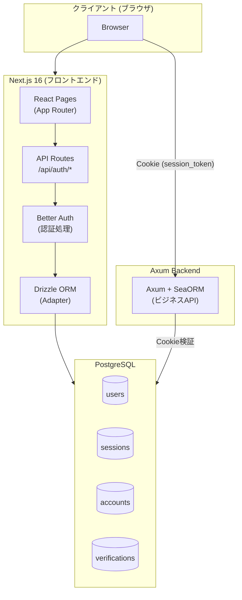
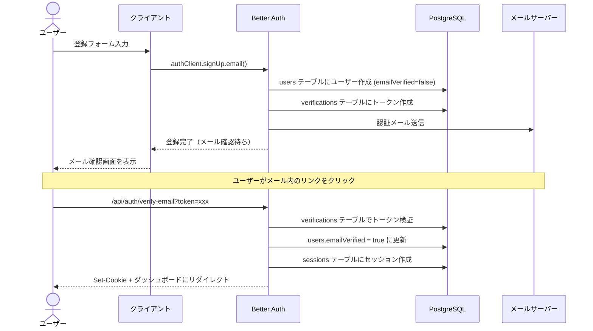
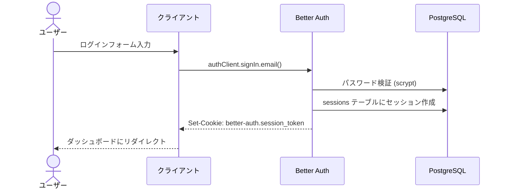
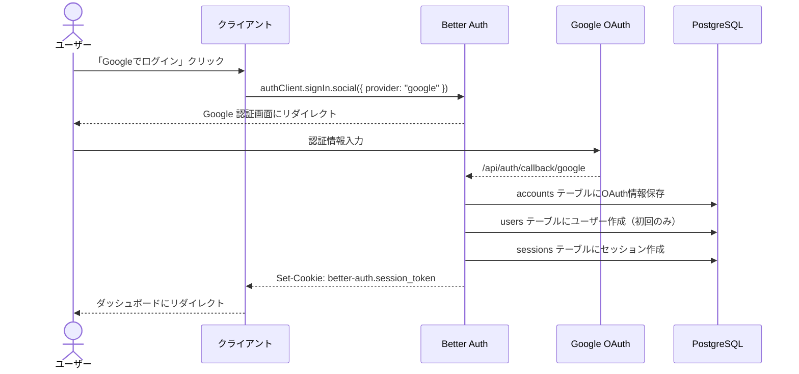
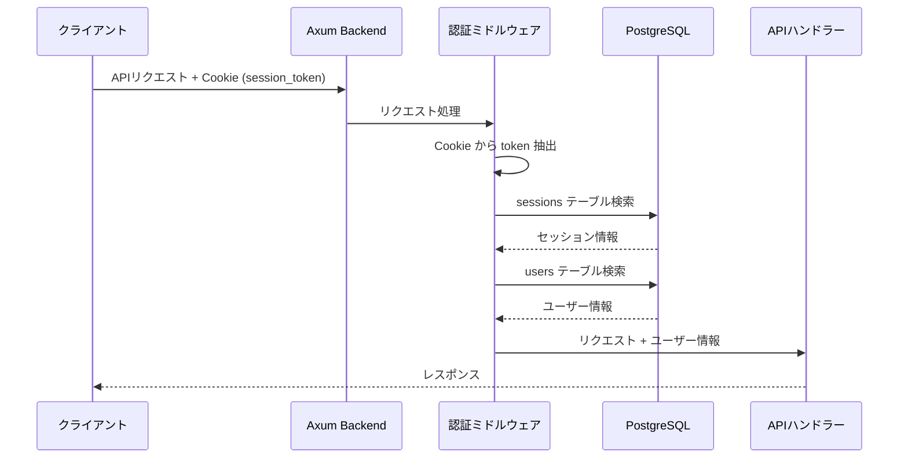

# Better Auth サンプルアプリ アーキテクチャ設計書

## 1. システム構成概要



## 2. 技術スタック

### フロントエンド
| 技術 | バージョン | 用途 |
|------|-----------|------|
| Next.js | 16.x | フレームワーク |
| React | 19.x | UIライブラリ |
| TypeScript | 5.x | 型安全性 |
| Better Auth | 最新 | 認証ライブラリ |
| Drizzle ORM | 最新 | DB Adapter |

### バックエンド
| 技術 | バージョン | 用途 |
|------|-----------|------|
| Rust | stable | 言語 |
| Axum | 最新 | Webフレームワーク |
| SeaORM | 最新 | ORM |
| PostgreSQL | 16.x | データベース |

## 3. 認証フロー

### 3.1 メール/パスワード認証フロー

#### 会員登録（メール認証あり）



#### ログイン



### 3.2 Google OAuth 認証フロー



### 3.3 バックエンド認証フロー



## 4. データベース設計

### 4.1 Better Auth 管理テーブル（Drizzle で定義）

これらのテーブルは Better Auth の CLI で自動生成され、Next.js 側の Drizzle で管理します。

```sql
-- users テーブル
CREATE TABLE users (
    id TEXT PRIMARY KEY,
    name TEXT NOT NULL,
    email TEXT NOT NULL UNIQUE,
    email_verified BOOLEAN DEFAULT FALSE,
    image TEXT,
    created_at TIMESTAMP DEFAULT CURRENT_TIMESTAMP,
    updated_at TIMESTAMP DEFAULT CURRENT_TIMESTAMP,
    -- カスタムフィールド（退会用）
    deleted_at TIMESTAMP
);

-- sessions テーブル
CREATE TABLE sessions (
    id TEXT PRIMARY KEY,
    user_id TEXT NOT NULL REFERENCES users(id) ON DELETE CASCADE,
    token TEXT NOT NULL UNIQUE,
    expires_at TIMESTAMP NOT NULL,
    ip_address TEXT,
    user_agent TEXT,
    created_at TIMESTAMP DEFAULT CURRENT_TIMESTAMP,
    updated_at TIMESTAMP DEFAULT CURRENT_TIMESTAMP
);

-- accounts テーブル（OAuth用）
CREATE TABLE accounts (
    id TEXT PRIMARY KEY,
    user_id TEXT NOT NULL REFERENCES users(id) ON DELETE CASCADE,
    account_id TEXT NOT NULL,
    provider_id TEXT NOT NULL,
    access_token TEXT,
    refresh_token TEXT,
    access_token_expires_at TIMESTAMP,
    refresh_token_expires_at TIMESTAMP,
    scope TEXT,
    id_token TEXT,
    password TEXT,  -- メール/パスワード認証用（ハッシュ化済み）
    created_at TIMESTAMP DEFAULT CURRENT_TIMESTAMP,
    updated_at TIMESTAMP DEFAULT CURRENT_TIMESTAMP
);

-- verifications テーブル（メール検証、パスワードリセット用）
CREATE TABLE verifications (
    id TEXT PRIMARY KEY,
    identifier TEXT NOT NULL,
    value TEXT NOT NULL,
    expires_at TIMESTAMP NOT NULL,
    created_at TIMESTAMP DEFAULT CURRENT_TIMESTAMP,
    updated_at TIMESTAMP DEFAULT CURRENT_TIMESTAMP
);
```

### 4.2 SeaORM エンティティ（バックエンド用）

Axum バックエンドでは、認証テーブルを **読み取り専用** で参照します。
SeaORM のマイグレーションでテーブルを作成し、Drizzle はそのテーブルを使用します。

## 5. Cookie 設計

### Better Auth Cookie

| Cookie 名 | 用途 | 設定 |
|-----------|------|------|
| `better-auth.session_token` | セッショントークン | HttpOnly, Secure, SameSite=Lax |

### Cookie の流れ

```
1. ログイン成功時
   - Better Auth が Cookie を Set-Cookie ヘッダーで設定
   - ブラウザが Cookie を保存

2. API リクエスト時
   - ブラウザが自動的に Cookie を送信
   - Next.js API: Better Auth が自動検証
   - Axum API: ミドルウェアで手動検証

3. ログアウト時
   - Better Auth が Cookie を削除
   - sessions テーブルからセッションを削除
```

## 6. ディレクトリ構成

```
better-auth-sample/
├── frontend/                    # Next.js アプリケーション
│   ├── src/
│   │   ├── app/
│   │   │   ├── (auth)/         # 認証関連ページ
│   │   │   │   ├── login/
│   │   │   │   ├── register/
│   │   │   │   └── forgot-password/
│   │   │   ├── (protected)/    # 認証必須ページ
│   │   │   │   ├── dashboard/
│   │   │   │   ├── profile/
│   │   │   │   └── settings/
│   │   │   ├── api/
│   │   │   │   ├── auth/
│   │   │   │   │   └── [...all]/
│   │   │   │   │       └── route.ts
│   │   │   │   └── user/       # アプリ固有のAPI
│   │   │   │       └── withdraw/
│   │   │   │           └── route.ts
│   │   │   ├── layout.tsx
│   │   │   └── page.tsx
│   │   ├── lib/
│   │   │   ├── auth.ts         # Better Auth サーバー設定
│   │   │   ├── auth-client.ts  # Better Auth クライアント設定
│   │   │   └── db.ts           # Drizzle 設定
│   │   ├── db/
│   │   │   └── schema.ts       # Drizzle スキーマ
│   │   └── components/
│   │       ├── auth/
│   │       │   ├── LoginForm.tsx
│   │       │   ├── RegisterForm.tsx
│   │       │   └── SocialButtons.tsx
│   │       └── ui/
│   ├── drizzle.config.ts
│   ├── package.json
│   └── .env.local
│
├── backend/                     # Axum アプリケーション
│   ├── src/
│   │   ├── main.rs
│   │   ├── lib.rs
│   │   ├── routes/
│   │   │   ├── mod.rs
│   │   │   ├── public.rs       # 非認証API
│   │   │   └── protected.rs    # 認証必須API
│   │   ├── middleware/
│   │   │   ├── mod.rs
│   │   │   └── auth.rs         # 認証ミドルウェア
│   │   ├── entity/             # SeaORM エンティティ
│   │   │   ├── mod.rs
│   │   │   ├── users.rs
│   │   │   └── sessions.rs
│   │   └── migration/          # SeaORM マイグレーション
│   ├── Cargo.toml
│   └── .env
│
├── docs/                        # ドキュメント
│   ├── 01_architecture.md
│   ├── 02_better-auth-guide.md
│   ├── 03_database-schema.md
│   ├── 04_api-specification.md
│   └── 05_setup-guide.md
│
└── docker-compose.yml           # PostgreSQL
```

## 7. 責務分離

### Next.js (フロントエンド + 認証)
- UI のレンダリング
- Better Auth による認証処理
- 認証関連の API Route
- 退会処理などアプリ固有の認証ロジック
- Drizzle による認証テーブルのアダプター

### Axum (バックエンド)
- ビジネスロジック API
- Cookie ベースの認証検証（読み取り専用）
- SeaORM によるマイグレーション管理
- ビジネスデータの CRUD

### PostgreSQL
- 認証テーブル（users, sessions, accounts, verifications）
- ビジネスデータテーブル
- 単一データベースで両方を管理
