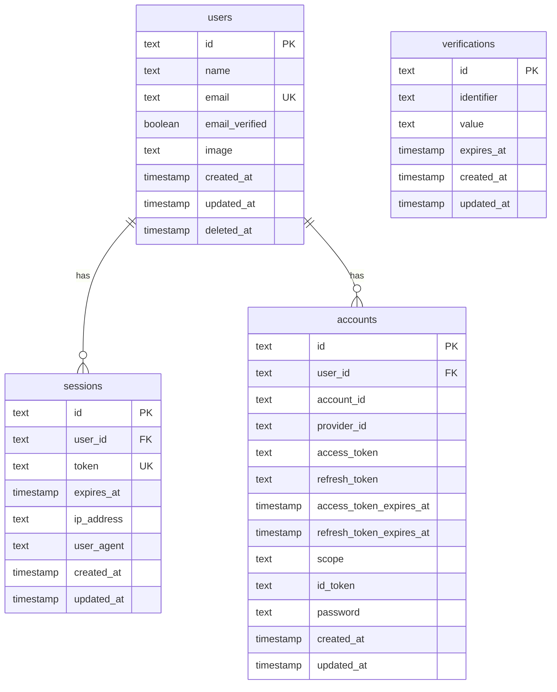

# データベーススキーマ設計書

## 1. 概要

本プロジェクトでは、単一の PostgreSQL データベースを使用し、以下の方針でテーブルを管理します。

| 管理者 | テーブル | 用途 |
|--------|----------|------|
| SeaORM (Rust) | 全テーブル | マイグレーション管理 |
| Drizzle (Next.js) | 認証テーブル | Better Auth アダプター |
| SeaORM (Rust) | 認証テーブル | 読み取り専用で参照 |

## 2. テーブル一覧

### 認証関連テーブル（Better Auth 管理）

| テーブル名 | 用途 |
|------------|------|
| `users` | ユーザー情報 |
| `sessions` | セッション情報 |
| `accounts` | 認証アカウント情報（OAuth + パスワード） |
| `verifications` | メール検証・パスワードリセット |

## 3. 詳細スキーマ

### 3.1 users テーブル

```sql
CREATE TABLE users (
    -- Better Auth 標準フィールド
    id TEXT PRIMARY KEY,
    name TEXT NOT NULL,
    email TEXT NOT NULL UNIQUE,
    email_verified BOOLEAN DEFAULT FALSE,
    image TEXT,
    created_at TIMESTAMP WITH TIME ZONE DEFAULT CURRENT_TIMESTAMP NOT NULL,
    updated_at TIMESTAMP WITH TIME ZONE DEFAULT CURRENT_TIMESTAMP NOT NULL,

    -- カスタムフィールド（退会機能用）
    deleted_at TIMESTAMP WITH TIME ZONE
);

-- インデックス
CREATE INDEX idx_users_email ON users(email);
CREATE INDEX idx_users_deleted_at ON users(deleted_at);
```

#### フィールド説明

| フィールド | 型 | 説明 |
|------------|-----|------|
| `id` | TEXT | Better Auth が生成する一意ID（UUID形式） |
| `name` | TEXT | ユーザー表示名 |
| `email` | TEXT | メールアドレス（ユニーク） |
| `email_verified` | BOOLEAN | メール検証済みフラグ |
| `image` | TEXT | プロフィール画像URL |
| `created_at` | TIMESTAMP | 作成日時 |
| `updated_at` | TIMESTAMP | 更新日時 |
| `deleted_at` | TIMESTAMP | 退会日時（ソフトデリート） |

### 3.2 sessions テーブル

```sql
CREATE TABLE sessions (
    id TEXT PRIMARY KEY,
    user_id TEXT NOT NULL REFERENCES users(id) ON DELETE CASCADE,
    token TEXT NOT NULL UNIQUE,
    expires_at TIMESTAMP WITH TIME ZONE NOT NULL,
    ip_address TEXT,
    user_agent TEXT,
    created_at TIMESTAMP WITH TIME ZONE DEFAULT CURRENT_TIMESTAMP NOT NULL,
    updated_at TIMESTAMP WITH TIME ZONE DEFAULT CURRENT_TIMESTAMP NOT NULL
);

-- インデックス
CREATE INDEX idx_sessions_user_id ON sessions(user_id);
CREATE INDEX idx_sessions_token ON sessions(token);
CREATE INDEX idx_sessions_expires_at ON sessions(expires_at);
```

#### フィールド説明

| フィールド | 型 | 説明 |
|------------|-----|------|
| `id` | TEXT | セッションの一意ID |
| `user_id` | TEXT | ユーザーID（外部キー） |
| `token` | TEXT | セッショントークン（Cookie に保存される値） |
| `expires_at` | TIMESTAMP | セッション有効期限 |
| `ip_address` | TEXT | ログイン時のIPアドレス |
| `user_agent` | TEXT | ログイン時のUser-Agent |
| `created_at` | TIMESTAMP | 作成日時 |
| `updated_at` | TIMESTAMP | 更新日時 |

### 3.3 accounts テーブル

```sql
CREATE TABLE accounts (
    id TEXT PRIMARY KEY,
    user_id TEXT NOT NULL REFERENCES users(id) ON DELETE CASCADE,
    account_id TEXT NOT NULL,
    provider_id TEXT NOT NULL,
    access_token TEXT,
    refresh_token TEXT,
    access_token_expires_at TIMESTAMP WITH TIME ZONE,
    refresh_token_expires_at TIMESTAMP WITH TIME ZONE,
    scope TEXT,
    id_token TEXT,
    password TEXT,  -- メール/パスワード認証用（ハッシュ化済み）
    created_at TIMESTAMP WITH TIME ZONE DEFAULT CURRENT_TIMESTAMP NOT NULL,
    updated_at TIMESTAMP WITH TIME ZONE DEFAULT CURRENT_TIMESTAMP NOT NULL,

    -- 複合ユニーク制約
    UNIQUE(provider_id, account_id)
);

-- インデックス
CREATE INDEX idx_accounts_user_id ON accounts(user_id);
CREATE INDEX idx_accounts_provider ON accounts(provider_id, account_id);
```

#### フィールド説明

| フィールド | 型 | 説明 |
|------------|-----|------|
| `id` | TEXT | アカウントの一意ID |
| `user_id` | TEXT | ユーザーID（外部キー） |
| `account_id` | TEXT | プロバイダーでのユーザーID（credential の場合は user_id と同じ） |
| `provider_id` | TEXT | プロバイダー識別子（"credential", "google" 等） |
| `access_token` | TEXT | アクセストークン（OAuth 用） |
| `refresh_token` | TEXT | リフレッシュトークン（OAuth 用） |
| `access_token_expires_at` | TIMESTAMP | アクセストークン有効期限 |
| `refresh_token_expires_at` | TIMESTAMP | リフレッシュトークン有効期限 |
| `scope` | TEXT | 許可されたスコープ |
| `id_token` | TEXT | OpenID Connect の ID トークン |
| `password` | TEXT | ハッシュ化されたパスワード（メール/パスワード認証用） |
| `created_at` | TIMESTAMP | 作成日時 |
| `updated_at` | TIMESTAMP | 更新日時 |

### 3.4 verifications テーブル

```sql
CREATE TABLE verifications (
    id TEXT PRIMARY KEY,
    identifier TEXT NOT NULL,
    value TEXT NOT NULL,
    expires_at TIMESTAMP WITH TIME ZONE NOT NULL,
    created_at TIMESTAMP WITH TIME ZONE DEFAULT CURRENT_TIMESTAMP NOT NULL,
    updated_at TIMESTAMP WITH TIME ZONE DEFAULT CURRENT_TIMESTAMP NOT NULL
);

-- インデックス
CREATE INDEX idx_verifications_identifier ON verifications(identifier);
CREATE INDEX idx_verifications_expires_at ON verifications(expires_at);
```

#### フィールド説明

| フィールド | 型 | 説明 |
|------------|-----|------|
| `id` | TEXT | 検証レコードの一意ID |
| `identifier` | TEXT | 識別子（メールアドレス等） |
| `value` | TEXT | 検証トークン |
| `expires_at` | TIMESTAMP | 有効期限 |
| `created_at` | TIMESTAMP | 作成日時 |
| `updated_at` | TIMESTAMP | 更新日時 |

## 4. ER図



## 5. 退会処理のデータ変更

### メール/パスワードユーザーの退会

```sql
-- 退会処理
UPDATE users
SET
    deleted_at = CURRENT_TIMESTAMP,
    email = 'deleted_' || id || '@deleted.local',  -- 難読化
    name = 'Deleted User'
WHERE id = :user_id;

-- セッション削除
DELETE FROM sessions WHERE user_id = :user_id;

-- アカウント削除（パスワード認証の場合は "credential" レコード）
DELETE FROM accounts WHERE user_id = :user_id;
```

### Google 認証ユーザーの退会

Google 認証ユーザーもメール/パスワードユーザーと同様に処理します。
再入会時は新規ユーザーとして登録されます。

```sql
-- 退会処理
UPDATE users
SET
    deleted_at = CURRENT_TIMESTAMP,
    email = 'deleted_' || id || '@deleted.local',
    name = 'Deleted User'
WHERE id = :user_id;

-- セッション削除
DELETE FROM sessions WHERE user_id = :user_id;

-- アカウント削除
DELETE FROM accounts WHERE user_id = :user_id;
```

## 6. SeaORM マイグレーション

### ディレクトリ構成

```
backend/
└── migration/
    └── src/
        ├── lib.rs
        ├── m20240101_000001_create_users_table.rs
        ├── m20240101_000002_create_sessions_table.rs
        ├── m20240101_000003_create_accounts_table.rs
        └── m20240101_000004_create_verifications_table.rs
```

### マイグレーションコマンド

```bash
# マイグレーション実行
cd backend
sea-orm-cli migrate up

# マイグレーション確認
sea-orm-cli migrate status

# ロールバック
sea-orm-cli migrate down
```

## 7. Drizzle スキーマとの同期

SeaORM でマイグレーションを管理するため、Drizzle はスキーマ定義のみを行い、マイグレーションは実行しません。

```typescript
// drizzle.config.ts
export default defineConfig({
  schema: "./src/db/schema.ts",
  // out は設定しない（マイグレーション生成を無効化）
  dialect: "postgresql",
  dbCredentials: {
    url: process.env.DATABASE_URL!,
  },
});
```

Drizzle スキーマは SeaORM マイグレーションで作成されたテーブル構造と完全に一致させる必要があります。
